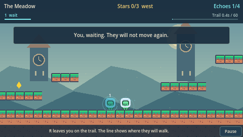
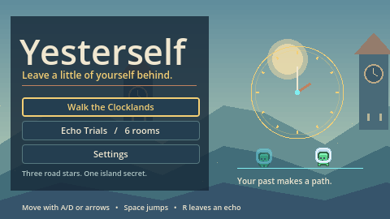

# Yesterself

An open-world 2D platformer in **Godot 4.7**. You walk the Clocklands as one continuous place. Press **R** and the trail you just walked is planted as an **echo**: a past self that replays that path in the world and then waits, holding a switch or standing where you can climb it, while you keep going.

Three road stars open the summit. A fourth, rose-colored star waits on the island for a harder climb. The whole land is a text map in `world/clocklands.tscn`, so the world you play is the world in this repo.

The title screen also opens **six Echo Trials**. In a room, R rewinds time and the echo repeats the attempt. In the Clocklands, R does not rewind: the past stays where you left it.



The demo includes a title and trial picker, pause and controls, saved records, replay timelines, layered scenery, and original sound effects. Settings control sound, echo paths, and reduced particles and shake. Escape or Start pauses; losing focus pauses automatically.

| Trial | What your past makes possible | Par echoes |
|---|---|---|
| The Ground Floor | Learn the jump and cross the gap | 0 |
| The Locked Door | Leave someone holding the switch | 1 |
| The High Ledge | Use a frozen echo as a step | 1 |
| The Pendulum | Wait for the moving saw and cross an echo-held door | 1 |
| The Counterweight | Ride a lift while your past holds its plate | 1 |
| Two of Us | Hold two adjacent barriers open together | 2 |

Meet par for a medal beside the trial. Best echo counts and island discovery survive closing the game, using `user://yesterself.json` (browser storage in the web build). An unfinished walk starts fresh.



## Controls

| Action | Keyboard | Gamepad |
|---|---|---|
| Move | A / D or ← → | Left stick / D-pad |
| Jump | Space, W or ↑ | A |
| Plant this trail as an echo (Clocklands) / commit the attempt (rooms) | R | X |
| Return to the trailhead (Clocklands) / retry the attempt (rooms) | T | Y |
| Forget the newest echo | Backspace | LB |
| Walk the Clocklands again, or the next room | Enter | A |
| Pause / controls / settings | Escape | Start |

## Run it

```bash
brew install --cask godot   # Godot 4.7.2
godot --path .              # play
godot -e                    # open the editor
```

Open the title screen and choose the Clocklands or a trial. To open a room directly:

```bash
godot --path . res://levels/level_04.tscn
```

## Test it

```bash
scripts/test.sh                       # all unit, physics and level-solution tests
scripts/test.sh -gselect=test_player  # one file
```

Every room has a solution test that plays a scripted run through the real level, plus a test guarding its intended trick. The Clocklands have a steered run that collects all road stars and a test that the summit cannot be jumped alone. Save and settings tests use temporary files and cannot overwrite player progress. The runner fails if any test script does not load, because GUT on its own would silently skip it.

## Web build

```bash
python3 scripts/fetch_web_templates.py 4.7.2 "$HOME/Library/Application Support/Godot/export_templates/4.7.2.stable"
scripts/export_web.sh
python3 -m http.server 8090 --directory build/web   # then open http://localhost:8090
```

`fetch_web_templates.py` downloads only the ~20 MB of web templates instead of Godot's full 1.3 GB template archive. CI builds the same web version on every push and attaches it as the `yesterself-web` artifact.

## The Clocklands

One map, three regions, west to east:

```
The Gate                         The Meadow                    The Summit
[far star | door | switch]       road, then a step and an island  a cliff you cannot jump
 a shelf to wait on              the island star is optional      plant an echo, then climb it
```

A `@` on the ground sets your trailhead. The next echo replays from there, and the line on the ground shows where that past you will walk. T or a fall sends you back without erasing stars or planted echoes.

The island star is not required. The summit opens without it, then tells you it is still up there. Two echoes climb it: one to the step, one from the step to the island. The road itself only needs the other two. A clear saves your best echo count, so the next walk has something to beat.

## How it works

- `world/clocklands.gd` builds the open world from the same text-map parser and plants echoes without rewinding it.
- `levels/level.gd` builds each room from a text map and runs the loop: commit, retry, undo, death and exit.
- `loop/` holds the loop clock (`LoopController`), the recordings, and the recorder.
- `actors/` has the player (`CharacterBody2D`) and the echo (`AnimatableBody2D`).
- `props/` has the switch, door, star and exit, which talk to each other through signals.
- `props/hazard.gd` computes a saw's position from the loop tick. `props/lift.gd` raises a platform while its switch is pressed.
- `effects/` draws short action bursts and synthesizes original PCM chimes. Cosmetic clocks never drive movement.
- `ui/` contains the title, shared settings, pause/results overlay, and replay HUD.
- `autoload/progress_store.gd` validates versioned JSON before applying saved records or settings.
- `docs/learning/` contains a note per milestone explaining the Godot concepts used, each with exercises.

If the Clocklands are useful to you, a star on this repo helps other people find them.

## Credits

Art: [Kenney Pixel Platformer](https://kenney.nl/assets/pixel-platformer) (CC0). See `assets/CREDITS.md`.

## License

Code: MIT. Assets: CC0; see the credits for Kenney art and original demo visuals and sounds.
